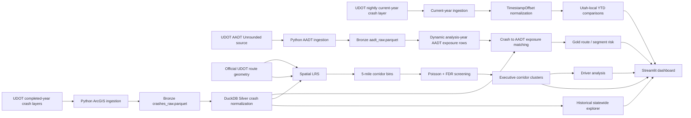

# Data Lineage

## Governance design

- Raw/intermediate snapshots and the local DuckDB warehouse are reproducible and excluded from Git history.
- Small Gold outputs and reports required by the public dashboard are intentionally versioned.
- No personal identifiers are introduced; the public crash source states that personal identification information is removed.
- Current-year source freshness is tracked separately from crash occurrence dates.
- AADT proxy use is explicit through `analysis_year`, `aadt_year`, and `aadt_proxy_flag`.
- Match quality and data-quality checks are analytical gates rather than hidden assumptions.
- Current-year YTD observations remain separate from the completed-year historical prioritization model.
