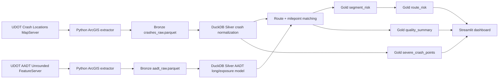

# Data Lineage

## Governance design

- Raw source snapshots are reproducible and excluded from Git history.
- Small Gold outputs are intended for the public dashboard.
- No personal identifiers are introduced.
- Source limitations are documented in the repository and dashboard.
- Match quality is treated as an analytical gate, not hidden.
